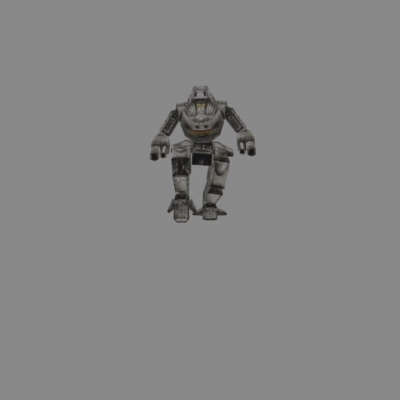

# MechWarrior 3 Asset Extractor

MechWarrior 3 Asset Extractor (`mech3ax`) is a cross-platform, open-source project to extract assets from certain games developed by Zipper Interactive™ to modern formats and back:

* the Recoil™ game (1999)
* the MechWarrior 3™ base game (1999)
* the MechWarrior 3 Pirate's Moon™ expansion (1999)
* the Crimson Skies™ game (2000)

Zipper Interactive™ was trademark or registered trademark of Sony Computer Entertainment America LLC. Other trademarks belong to the respective rightsholders.

Obviously, this is an unofficial fan effort and not connected to the developers, publishers, or rightsholders. [Join us on MW3 Discord](https://discord.gg/Be53gMy), or the Recoil Discord!

[](https://imgur.com/a/H5pB1Vd)

## How do I use this?

`mech3ax` is a very low-level tool. The goal is to extract all assets information comprehensively, and not necessarily make it easy to work with this data. In other words, the tools can be used for modding, but don't make it easy. This is expected and unlikely to change (sorry!).

There are three ways to use `mech3ax`:

* The two command-line executables, `unzbd` and `rezbd`. If you don't know what a command-line is, this project may not be for you.
* The `mech3ax` library, with a C-compatible interface/API. This is the lowest level.
* An unreleased C# wrapper for the `mech3ax` library. This is recommended, as the API is strongly typed, and so it is relatively easy to upgrade to new versions.

Roughly speaking, the output of from ZBD conversions will be one or more JSON documents, or PNG images. In the case of multiple documents/images, `unzbd` will write everything into a single ZIP file, along with metadata.

The conversions are binary-accurate. So converting from a `*.zbd` file and then back to a `*.zbd` file produces exactly the same file, byte-for-byte.

## Currently supported

### Support matrix

Legend:

* ✅ works
* ✔️ largely works, with some caveats
* ❌ not implemented
* ⬛ not applicable

| Type                                                   | RC | MW | PM | CS |
| ------------------------------------------------------ | -- | -- | -- | -- |
| `sounds*.zbd`                                          | ✅ | ✅ | ✅ | ✅ |
| `interp.zbd`                                           | ✅ | ✅ | ✅ | ✅ |
| `messages.dll`/`Mech3Msg.dll`/`strings.dll` *          | ✅ | ✅ | ✅ | ✅ |
| `zrdr.zbd`/`reader*.zbd`                               | ✅ | ✅ | ✅ | ✅ |
| Image/texture ZBDs                                     | ✅ | ✅ | ✅ | ✅ |
| `mechlib.zbd`                                          | ⬛ | ✅ | ✅ | ⬛ |
| `motion.zbd`                                           | ⬛ | ✅ | ✅ | ⬛ |
| `gamez.zbd`                                            | ✅ | ✅ | ✅ | ✅ |
| `anim.zbd`/`cam_anim.zbd`/`mis_anim.zbd`               | ❌ | ✅ | ❌ | ❌ |
| `m*.zmap`                                              | ✅ | ⬛ | ⬛ | ⬛ |
| `planes.zbd` *                                         | ⬛ | ⬛ | ⬛ | ✅ |

\* Messages/localisation DLLs cannot easily be reconstructed, and so there is no support for this in `rezbd`.

\* For `planes.zbd`, please use the `gamez` mode.

### MechWarrior 3

Various versions of the MechWarror 3 base game have been tested (including US versions 1.0/1.1/1.2/Gold Edition, German version 1.0, each with and without the 1.2 patch). If you are in possession of any other versions, please get in touch!

However, for simplicity, the only version guaranteed to work is v1.2.

- Sound archives (`sounds*.zbd`) containing sound effects to ZIP archives of WAV files - note the background music is streamed from the CD and never installed
- Interpreter scripts (`interp.zbd`) to a JSON file - these small, interpreted scripts drive which files the engine loads
- All image/texture packages (`rimage.zbd`, `rmechtex*.zbd`, `rtexture*.zbd`, `texture*.zbd`) to ZIP archives of PNG files
- Reader archives (`reader*.zbd`) containing game data to ZIP archives of JSON files
- Motion data (`motion.zbd`) containing 'mech animation data to ZIP archives of JSON files - because the model data is not very well understood, applying the animations isn't perfect. Some limbs have incorrect translations; it's possible these aren't meant to be applied
- Mechlib archives (`mechlib.zbd`) containing 'mech models, and texture/material information to ZIP archives of JSON files
- All messages can be extracted from `Mech3Msg.dll` to a JSON file
- Pre-compiled animation definitions (`anim.zbd`) containing (baked) animations also present in reader archives (probably for faster loading) to ZIP archives of JSON files
- Game asset/GameZ archives (`gamez.zbd`) containing texture references, materials, meshes, and nodes for each scenario to ZIP archives of JSON files (some of this data is still rough)

Not supported (yet?):

- Savegame files
- The demo likely won't ever be supported, because it uses different versions/data structures
- Background music/ambient tracks [can be extracted from the CD](https://terranmechworks.com/mech3doc/ambient-tracks/) using e.g. [ExactAudioCopy](http://www.exactaudiocopy.de/) or other programs, so it isn't worth re-inventing this
- Similarly, video files [can be converted using `ffmpeg`](https://terranmechworks.com/mech3doc/avi-files/) to modern codecs, or played back using [VLC media player](https://www.videolan.org/vlc/)

### Pirate's Moon

* `anim.zbd` files are not supported yet

### Recoil

* `anim.zbd` files are not supported yet

### Crimson Skies

* `cam_anim.zbd`/`mis_anim.zbd` files are not supported yet

## Using the command-line executables

**You will need a copy of the game. Do not ask me for an (illegal) copy.**

It's easiest to [grab the pre-build binaries from releases](https://github.com/TerranMechworks/mech3ax/releases). Otherwise, see the [development](#development) section below on how to build from source. There are two command-line programs.

**Warning**: The output file formats aren't stable yet and may change in future - please don't build tools around the output yet.

On macOS or Linux, you can run them like this:

```bash
unzbd mw interp "original/zbd/interp.zbd" "interp.json"
rezbd mw interp "interp.json" "interp.zbd"
# the files should be the same
cmp "original/zbd/interp.zbd" "interp.zbd"
```

On Windows, you can use either the command line (`cmd.exe`) or Powershell (which I'd recommend):

```powershell
PS> unzbd.exe mw interp "C:\Program Files (x86)\MechWarrior 3\zbd\interp.zbd" ".\interp.json"
PS> rezbd.exe mw interp ".\interp.json" ".\interp.zbd"
PS> comp /M "C:\Program Files (x86)\MechWarrior 3\zbd\interp.zbd" ".\interp.zbd"
Comparing C:\Program Files (x86)\MechWarrior 3\zbd\interp.zbd and .\interp.zbd...
Files compare OK
```

Supported games (support may be partial):

* `mw` (MechWarrior 3)
* `pm` (Pirate's Moon)
* `rc` (Recoil)
* `cs` (Crimson Skies)

Provided subcommands:

* `license` prints license information
* `sounds` (produces a `*.zip` file)
* `interp` (produces a `*.json` file)
* `reader` (produces a `*.zip` file)
* `messages` (produces a `*.json` file, `unzbd` only)
* `textures` (produces a `*.zip` file)
* `motion` (produces a `*.zip` file, `mw` and `pm` only)
* `mechlib` (produces a `*.zip` file, `mw` and `pm` only)
* `gamez` (produces a `*.zip` file)
* `anim` (produces a `*.zip` file, `mw` only)
* `zmap` (produces a `*.json` file, `rc` only)

## Changelog

See [CHANGELOG](CHANGELOG.md).

## Development

[Rust](https://www.rust-lang.org/) is required.

## DotNet/C# codegen

To run the C# codegen and copy it to Mech3DotNet, perform something like the following steps:

```bash
MECH3DOTNET_AUTOGEN_PATH="../Mech3DotNet/Mech3DotNet/AutoGen/"
rm -r "output/" || true
rm -r "$MECH3DOTNET_AUTOGEN_PATH" || true
mkdir -p "output/Mech3DotNet"
env RUST_BACKTRACE=1 cargo run --bin mech3ax-metadata-gen
cp -r "output/Mech3DotNet/AutoGen/" "$MECH3DOTNET_AUTOGEN_PATH"
```

## Release procedure

1. Review changelog, and add the date
1. Commit, push, and wait for CI
1. Create a tag of the version (e.g. `git tag -a v0.1.0 -m "2024-02-10" -s`)
1. Push the tag (`git push origin v0.1.0`)
1. The build will automatically create a release as a draft
1. The CLI version is automatically set from the tag and the current date
1. Add changelog items to the release notes via the GitHub web interface
1. Publish the release via the GitHub web interface

## License

Licensed under the European Union Public Licence (EUPL) 1.2 ([LICENSE](LICENSE) or https://joinup.ec.europa.eu/collection/eupl/eupl-text-eupl-12).
